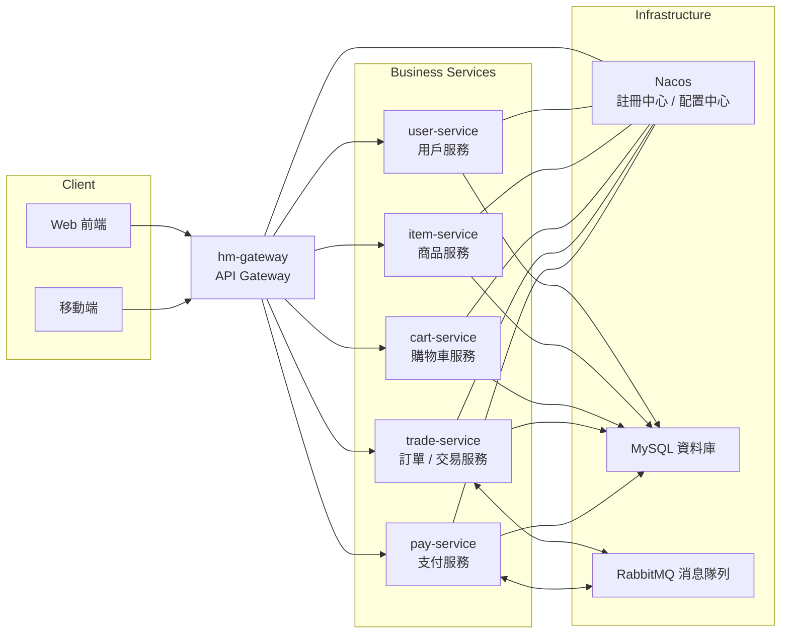

# 🛒 HMall - Microservices E-commerce Platform

A distributed e-commerce platform built with Spring Cloud Alibaba microservices architecture, featuring high concurrency, scalability, and enterprise-grade performance.

## 🌟 Features | 功能特色

### 🛍️ **Customer Experience | 用戶體驗**

-   **Product Catalog** | 商品目錄：Multi-category browsing with advanced filtering
-   **Shopping Cart** | 購物車：Real-time cart synchronization across devices
-   **Secure Checkout** | 安全結算：Multiple payment gateways with fraud detection
-   **Order Tracking** | 訂單追蹤：Real-time delivery status and notifications
-   **User Reviews** | 用戶評價：Rating and review system with sentiment analysis

### ⚡ **Admin Management | 管理功能**

-   **Product Management** | 商品管理：Bulk operations, inventory tracking, price optimization
-   **Order Processing** | 訂單處理：Automated workflow with exception handling
-   **Customer Service** | 客戶服務：Integrated support ticket system
-   **Analytics Dashboard** | 數據分析：Real-time sales metrics and business intelligence
-   **Promotion Engine** | 促銷引擎：Coupon management and discount campaigns

## 🏗️ Microservices Architecture | 微服務架構



## 🛠️ Technology Stack | 技術棧

### **Microservices Framework | 微服務框架**

-   **Spring Cloud Alibaba 2021.0.4.0**
-   **Spring Boot 2.7.12**
-   **Nacos 2.2.1** - Service Discovery & Configuration
-   **Gateway** - API Gateway & Load Balancing
-   **OpenFeign** - Service-to-Service Communication
-   **Sentinel** - Circuit Breaker & Rate Limiting

### **Data & Messaging | 數據與消息**

-   **MySQL 8.0** - Primary Database
-   **RabbitMQ 3.9** - Message Queue & Event Streaming
-   **MyBatis Plus 3.5** - ORM Framework

### **DevOps & Monitoring | 運維監控**

-   **Docker** - Containerization
-   **Maven 3.8** - Build Management
-   **Swagger 3.0** - API Documentation
-   **SLF4J + Logback** - Logging Framework

## 🚀 Quick Start | 快速開始

### **Prerequisites | 環境要求**

```yaml
Environment Requirements:
  - JDK: OpenJDK 11+
  - Maven: 3.8+
  - Docker: 20.10+
  - Docker Compose: 2.0+

Infrastructure Services:
  - MySQL: 8.0+
  - RabbitMQ: 3.9+
  - Nacos: 2.2.1+
```

### **Installation | 安裝部署**

1.  **Clone Project | 克隆項目**

    ```bash
    git clone https://github.com/DamonKima/hmall.git
    cd hmall
    ```

2.  **Start Infrastructure | 啟動基礎設施**

    ```bash
    # Using Docker Compose
    docker-compose -f docker/docker-compose.yml up -d
    
    # Verify services are running
    docker-compose ps
    ```

3.  **Database Initialization | 數據庫初始化**

    ```bash
    # Import database schema and data
    mysql -h localhost -P 3306 -u root -p hmall < sql/hmall.sql
    


4.  **Configuration | 服務配置**

    ```yaml
    # application-dev.yml (each service)
    spring:
      cloud:
        nacos:
          discovery:
            server-addr: localhost:8848
          config:
            server-addr: localhost:8848
      datasource:
        url: jdbc:mysql://localhost:3306/hmall?useSSL=false&serverTimezone=UTC
        username: root
        password: your_password
    ```

5.  **Start Services | 啟動服務**

    ```bash
    # Start services in order
    mvn clean install
    
    # Start Nacos first
    cd nacos && sh startup.sh -m standalone
    
    # Start each microservice
    java -jar gateway-service/target/gateway-service.jar
    java -jar user-service/target/user-service.jar
    java -jar product-service/target/product-service.jar
    java -jar cart-service/target/cart-service.jar
    java -jar order-service/target/order-service.jar
    java -jar payment-service/target/payment-service.jar
    ```

## 🐳 Docker Deployment | Docker 部署指南

For a quick and consistent deployment across environments (VPS, Cloud, Local), use the provided Docker setup.

### 1. Build Project | 构建项目

First, package the Java applications into JAR files. Ensure you are in the project root.

```bash
mvn clean package -DskipTests
```

### 2. Start Environment | 启动环境

Run the entire microservices cluster (including Nacos, MySQL, RabbitMQ) with one command:

```bash
docker-compose up -d --build
```

### 3. Import Configurations | 导入配置

Since Nacos starts with an empty database, you need to import the configurations manually **once**.

1.  Wait for Nacos to start (~30s).
2.  Access Console: `http://localhost:8848/nacos` (User/Pass: `nacos`/`nacos`).
3.  Go to **Configuration Management** -> **Import**.
4.  Upload the `nacos_config_import.zip` file located in the project root.
5.  Select **Overwrite** mode.

Now all services (Gateway, User, Item, etc.) will pick up the configs and register themselves.

### 4. Verify | 验证

-   **Nacos**: Check Service List at `http://localhost:8848/nacos`.
-   **Gateway**: Access `http://localhost:8080`.
-   **Sentinel**: Access `http://localhost:8090`.
-   **RabbitMQ**: Access `http://localhost:15672`.

### 5. Default Accounts | 默认账号

| Service | Username | Password |
|---------|----------|----------|
| Nacos | nacos | nacos |
| RabbitMQ | hmall | hmall123 |
| Sentinel | sentinel | sentinel |
| MySQL | root | 123 |
| 商城用户 | jack | 123 |

### 6. Server Requirements | 服务器配置要求

Docker 部署需要的最低配置：
- **内存**: 4GB+
- **磁盘**: 20GB+
- **CPU**: 2核+

---


## 📊 Service Details | 服務詳情

### **🔐 User Service | 用戶服務**

-   **Features**: Registration, Authentication, Profile Management
-   **Database**: user, user_profile, user_address
-   **Security**: JWT token + BCrypt encryption

### **📦 Product Service | 商品服務**

-   **Features**: Catalog Management, Inventory Tracking, Price Engine
-   **Database**: product, category, brand, inventory

### **🛒 Cart Service | 購物車服務**

-   **Features**: Cart Management, Session Sync, Batch Operations
-   **Sync**: Real-time synchronization across devices
-   **Optimization**: Cart merge for logged-in users

### **📋 Order Service | 訂單服務**

-   **Features**: Order Processing, Status Tracking, Workflow Management
-   **Database**: orders, order_items, order_log
-   **Messaging**: RabbitMQ for order events
-   **State Machine**: Order status transition management

### **💳 Payment Service | 支付服務**

-   **Features**: Multiple Payment Gateways, Transaction Management
-   **Integration**: Alipay, WeChat Pay, Bank Cards
-   **Security**: PCI DSS compliance, encryption
-   **Reconciliation**: Automated payment reconciliation

## 🔥 Performance Highlights | 性能亮點

### **⚡ High Concurrency | 高併發處理**

-   **Load Balancing**: Gateway for traffic distribution
-   **Connection Pooling**: HikariCP with optimized settings
-   **Async Processing**: CompletableFuture for non-blocking operations
-   **Result**: Support for 10,000+ concurrent users

### **🚀 Caching Strategy | 緩存策略**

-   **Multi-level Caching**: L1 (Local) L2 (Database)
-   **Cache Warming**: Preload hot data during startup
-   **Cache Invalidation**: Event-driven cache refresh
-   **Performance Gain**: 80% reduction in database queries

### **🔄 Message-Driven Architecture | 消息驅動架構**

-   **Event Sourcing**: Domain events for data consistency
-   **SAGA Pattern**: Distributed transaction management
-   **Dead Letter Queue**: Failed message handling and retry
-   **Throughput**: Process 50,000+ messages per second

## 📈 Monitoring & Operations | 監控運維

### **Health Checks | 健康檢查**

```bash
# Service health endpoints
GET /actuator/health          # Overall health
GET /actuator/metrics         # Performance metrics
GET /actuator/info           # Service information
```

### **Distributed Tracing | 分佈式追蹤**

-   **Sleuth Integration**: Request tracing across services
-   **Zipkin Dashboard**: Visual request flow analysis
-   **Performance Monitoring**: Response time and error rate tracking

## 🧪 Testing | 測試策略

### **Test Coverage | 測試覆蓋**

-   **Unit Tests**: 90%+ code coverage with JUnit 5
-   **Integration Tests**: Service-to-service communication
-   **Load Testing**: JMeter scripts for performance validation
-   **Contract Testing**: Pact for API contract verification

## 🔧 Development Tools | 開發工具

### **Code Quality | 代碼質量**

-   **Checkstyle**: Code style enforcement
-   **SpotBugs**: Static analysis for bug detection
-   **SonarQube**: Code quality metrics and technical debt

### **API Documentation | API文檔**

-   **Swagger UI**: Interactive API documentation
-   **Postman Collection**: Ready-to-use API testing collection

## 🚀 Deployment | 部署方案

### **Production Deployment | 生產部署**

```yaml
# Kubernetes deployment example
apiVersion: apps/v1
kind: Deployment
metadata:
  name: user-service
spec:
  replicas: 3
  selector:
    matchLabels:
      app: user-service
  template:
    metadata:
      labels:
        app: user-service
    spec:
      containers:
      - name: user-service
        image: hmall/user-service:1.0.0
        ports:
        - containerPort: 8081
```


## 🤝 Contributing | 贡献指南

1.  **Fork the repository**
2.  **Create feature branch** (`git checkout -b feature/awesome-feature`)
3.  **Follow coding standards** (Google Java Style Guide)
4.  **Write comprehensive tests**
5.  **Commit changes** (`git commit -m 'Add awesome feature'`)
6.  **Push to branch** (`git push origin feature/awesome-feature`)
7.  **Open Pull Request**

## 📄 License | 许可证

This project is licensed under the **Apache License 2.0** - see the [LICENSE](https://claude.ai/chat/LICENSE) file for details.

------

*Built with ❤️ by developers, for developers*