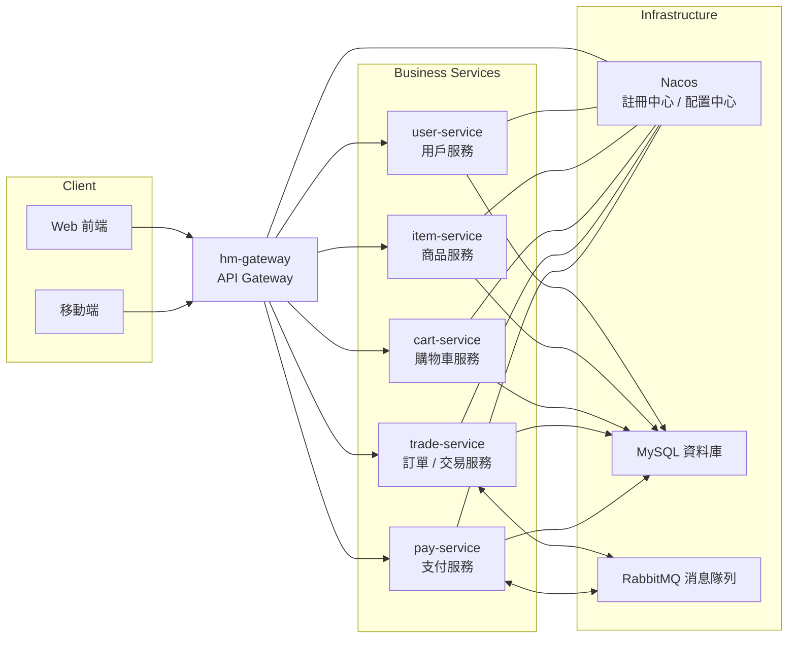

# 🛒 HMall - Microservices E-commerce Platform

A distributed e-commerce platform built with Spring Cloud Alibaba microservices architecture, featuring high concurrency, scalability, and enterprise-grade performance.

## 🌟 Features | 功能特色

### 🛍️ **Customer Experience | 用戶體驗**

-   **Product Catalog** | 商品目錄：Multi-category browsing with advanced filtering
-   **Shopping Cart** | 購物車：Real-time cart synchronization across devices
-   **Secure Checkout** | 安全結算：Multiple payment gateways with fraud detection
-   **Order Tracking** | 訂單追蹤：Real-time delivery status and notifications
-   **User Reviews** | 用戶評價：Rating and review system with sentiment analysis

### ⚡ **Admin Management | 管理功能**

-   **Product Management** | 商品管理：Bulk operations, inventory tracking, price optimization
-   **Order Processing** | 訂單處理：Automated workflow with exception handling
-   **Customer Service** | 客戶服務：Integrated support ticket system
-   **Analytics Dashboard** | 數據分析：Real-time sales metrics and business intelligence
-   **Promotion Engine** | 促銷引擎：Coupon management and discount campaigns

## 🏗️ Microservices Architecture | 微服務架構



## 🛠️ Technology Stack | 技術棧

### **Microservices Framework | 微服務框架**

-   **Spring Cloud 2021.0.3**
-   **Spring Cloud Alibaba 2021.0.4.0**
-   **Spring Boot 2.7.12**
-   **Nacos** - Service Discovery & Configuration Management
-   **Spring Cloud Gateway** - API Gateway & Routing
-   **Spring Cloud LoadBalancer** - Client-side Load Balancing
-   **OpenFeign** - Declarative HTTP Client
-   **Sentinel** - Circuit Breaker & Rate Limiting
-   **Seata** - Distributed Transaction Solution

### **Data & Messaging | 數據與消息**

-   **MySQL 8.0** - Primary Database
-   **RabbitMQ 3.9** - Message Queue & Event Streaming
-   **MyBatis Plus 3.4.3** - ORM Framework

### **DevOps & Tools | 運維工具**

-   **Docker** - Containerization
-   **Maven 3.8** - Build Management
-   **Knife4j + Swagger** - API Documentation
-   **SLF4J + Logback** - Logging Framework
-   **Hutool** - Java Utility Library

## 🚀 Quick Start | 快速開始

### **Prerequisites | 環境要求**

```yaml
Environment Requirements:
  - JDK: OpenJDK 11+
  - Maven: 3.8+
  - Docker: 20.10+
  - Docker Compose: 2.0+

Infrastructure Services:
  - MySQL: 8.0+
  - RabbitMQ: 3.9+
  - Nacos: 2.2.1+
```

### **Installation | 安裝部署**

1.  **Clone Project | 克隆項目**

    ```bash
    git clone https://github.com/kieranchan/hmall.git
    cd hmall
    ```

2.  **Start Infrastructure | 啟動基礎設施**

    ```bash
    # Using Docker Compose
    docker-compose -f docker/docker-compose.yml up -d
    
    # Verify services are running
    docker-compose ps
    ```

3.  **Database Initialization | 數據庫初始化**

    ```bash
    # Import database schema and data
    mysql -h localhost -P 3306 -u root -p hmall < sql/hmall.sql
    ```

4.  **Configuration | 服務配置**

    ```yaml
    # application-dev.yml (each service)
    spring:
      cloud:
        nacos:
          discovery:
            server-addr: localhost:8848
          config:
            server-addr: localhost:8848
      datasource:
        url: jdbc:mysql://localhost:3306/hmall?useSSL=false&serverTimezone=UTC
        username: root
        password: your_password
    ```

5.  **Start Services | 啟動服務**

    ```bash
    # Start services in order
    mvn clean install
    
    # Start Nacos first
    cd nacos && sh startup.sh -m standalone
    
    # Start each microservice
    java -jar hm-gateway/target/hm-gateway.jar
    java -jar user-service/target/user-service.jar
    java -jar item-service/target/item-service.jar
    java -jar cart-service/target/cart-service.jar
    java -jar trade-service/target/trade-service.jar
    java -jar pay-service/target/pay-service.jar
    ```

6.  **Verify Deployment | 驗證部署**

    ```bash
    # Check service registration in Nacos
    curl http://localhost:8848/nacos/v1/ns/instance/list?serviceName=user-service
    
    # Test API Gateway
    curl http://localhost:8080/api/users/profile
    ```

## 📊 Service Details | 服務詳情

### **🔐 User Service | 用戶服務**

-   **Features**: Registration, Authentication, Profile Management, Address Management
-   **Database**: user, address
-   **Security**: JWT token + BCrypt encryption

### **📦 Item Service | 商品服務**

-   **Features**: Catalog Management, Inventory Tracking, Price Management
-   **Database**: item

### **🛒 Cart Service | 購物車服務**

-   **Features**: Cart Management, Batch Operations
-   **Database**: cart
-   **Messaging**: RabbitMQ for cart synchronization

### **📋 Trade Service | 訂單服務**

-   **Features**: Order Processing, Status Tracking, Workflow Management
-   **Database**: order, order_detail, order_logistics
-   **Messaging**: RabbitMQ for order events
-   **State Machine**: Order status transition management

### **💳 Payment Service | 支付服務**

-   **Features**: Payment Order Management, Balance Payment, Transaction Management
-   **Database**: pay_order
-   **Integration**: Balance payment support
-   **Distributed Transaction**: Seata for payment consistency

## 🔥 Performance Highlights | 性能亮點

### **⚡ High Concurrency | 高併發處理**

-   **Load Balancing**: Spring Cloud LoadBalancer + Gateway for traffic distribution
-   **Connection Pooling**: HikariCP (Spring Boot default)
-   **Circuit Breaker**: Sentinel for fault tolerance and rate limiting
-   **Distributed Transaction**: Seata for data consistency across services

### **🔄 Message-Driven Architecture | 消息驅動架構**

-   **RabbitMQ Integration**: Asynchronous message processing for order and cart operations
-   **Event-Driven Design**: Order events, cart synchronization, and payment notifications
-   **Delayed Messages**: Order timeout checking with TTL queues
-   **Seata Distributed Transaction**: Ensures consistency across microservices

## 🔧 Development Tools | 開發工具

### **API Documentation | API文檔**

-   **Knife4j UI**: Enhanced Swagger UI with better visualization
-   **Access**: http://localhost:port/doc.html

## 🚀 Deployment | 部署方案

### **Production Deployment | 生產部署**

```yaml
# Kubernetes deployment example
apiVersion: apps/v1
kind: Deployment
metadata:
  name: user-service
spec:
  replicas: 3
  selector:
    matchLabels:
      app: user-service
  template:
    metadata:
      labels:
        app: user-service
    spec:
      containers:
      - name: user-service
        image: hmall/user-service:1.0.0
        ports:
        - containerPort: 8081
```


## 🤝 Contributing | 貢獻指南

1.  **Fork the repository**
2.  **Create feature branch** (`git checkout -b feature/awesome-feature`)
3.  **Follow coding standards** (Google Java Style Guide)
4.  **Write comprehensive tests**
5.  **Commit changes** (`git commit -m 'Add awesome feature'`)
6.  **Push to branch** (`git push origin feature/awesome-feature`)
7.  **Open Pull Request**

## 📄 License | 許可證

This project is licensed under the **Apache License 2.0** - see the [LICENSE](https://claude.ai/chat/LICENSE) file for details.

------

*Built with ❤️ by developers, for developers*